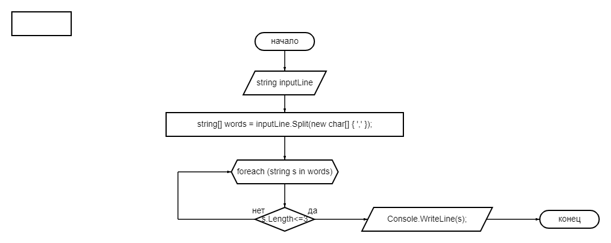

***Final_Work***

**Задача**

Написать программу, которая из имеющегося массива строк формирует массив из строк, длина которых меньше либо равна 3 символа. Первоначальный массив можно ввести с клавиатуры, либо задать на старте выполнения алгоритма. При решение не рекомендуется пользоваться коллекциями, лучше обойтись исключительно массивами

**Описание алгоритма решения:**
1. Ввод пользователем слов через запятую.
2. Используя Метод Split () возвращаем массив строк, сгенерированных разбиением исходной строки, разделенной разделителями (,)
3. Ищем условие задачи, по которому получившийся массив строк должен быть меньше или равен 3 символам.
4. Выводим результат.

***Блок-схема решения представлена ниже:***

**Описание алгоритма для второго решения:**
- 1. Строковый массив введен на этапе написания программы.
- 2. Для решения поставленной задачи используем методы.
  - 2.1 Метод CountLessThree - позволяет вычислить количество строк, по условию задания, длина которых не превышает 3 символа;
  - 2.2 Метод FillResultArray - позволяет сформировать массив, состоящий из строк, длина которых удовлетворяет условию задания.
  - 2.3 Метод PrintArray - позволяет вывести результат на экран.